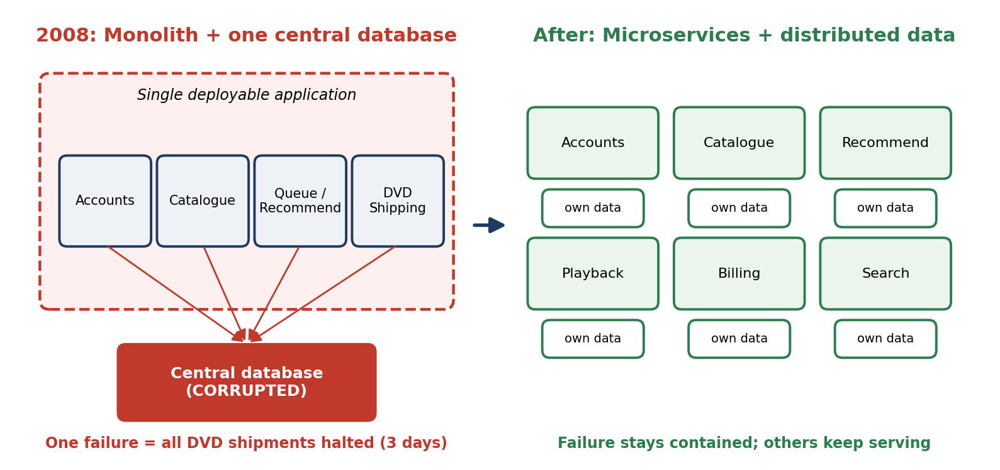
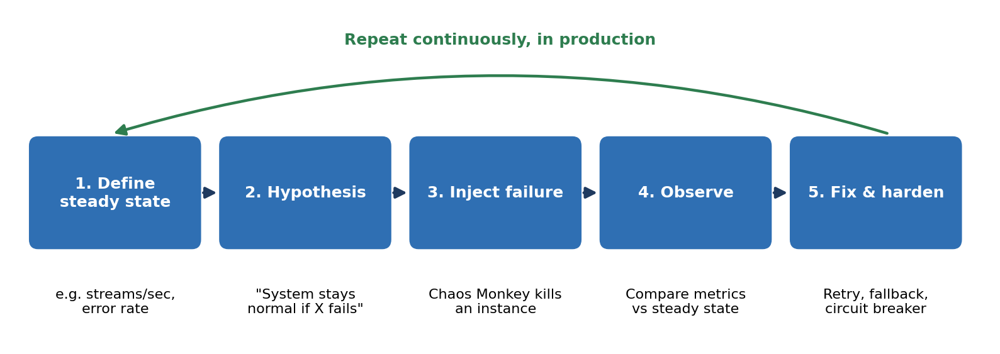
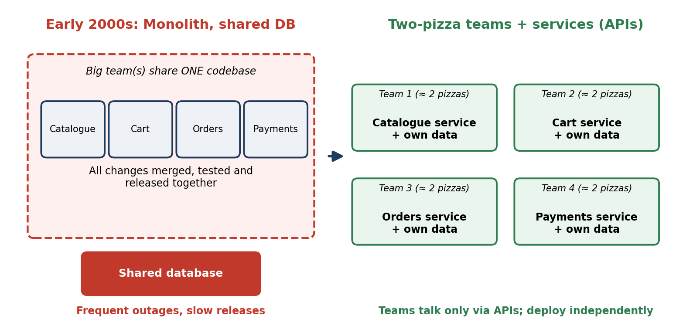
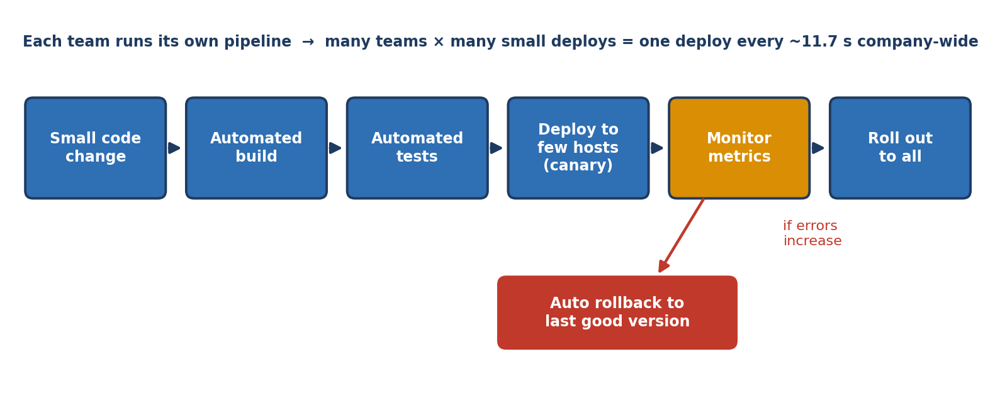

# DevOps Case Study Evaluation: CA-II

Name: Arunabha Mukhopadhyay  
PRN: 23070122049  
Class: DevOps-1

## Contents

- [Q1. Netflix Case Study](#q1-netflix-case-study)
- [Q2. Amazon Case Study](#q2-amazon-case-study)
- [Repository Implementation Notes](#repository-implementation-notes)

---

## Q1. Netflix Case Study

### Introduction
Netflix's 2008 database corruption incident exposed the limitations of its monolithic architecture. A failure in a critical database component could affect a large portion of the overall system and interrupt services.

### What happened in 2008?
In August 2008, a major database corruption in Netflix's own data centre stopped DVD shipments for about three days. Netflix then ran as one large application backed by a central relational database, so the corruption directly stopped the core business: customers could not be sent discs.

### Challenges with the monolithic architecture
- Single point of failure: failure of a critical database or application component could disrupt the entire service.
- Limited scalability: scaling the complete application was less efficient because individual components could not be scaled independently.
- Tightly coupled components: changes to one part of the application could affect other parts.
- Difficult deployments: large monolithic applications require more coordinated releases.
- Poor fault isolation: a failure in one component could propagate to other parts of the system.

### Specific challenges exposed by the incident
- Central database dependency: one central database served almost every function, so its corruption stopped the whole service.
- Vertical scaling only: capacity could be added only by buying bigger servers, which was expensive and had a hard limit.
- Slow recovery: with no independent copy of the data or failover path, recovery took days instead of seconds.
- Tight coupling: all modules were deployed and failed together, so one fault spread everywhere.
- Own data-centre infrastructure: Netflix had to build capacity in advance and manage hardware itself, which could not keep up with streaming growth.

### Microservices solution
Netflix gradually moved toward a microservices architecture, where functionality was divided into smaller, independently deployable services. This approach provided:

- independent deployment
- independent scaling
- better fault isolation
- easier maintenance
- greater flexibility
- reduced impact of individual service failures

### DevOps principles applied
- Move to the cloud (AWS): Netflix migrated from its data centre to Amazon Web Services, gaining elastic, on-demand capacity.
- Distributed data: relational single-database storage was replaced by distributed NoSQL stores such as Cassandra, replicated across zones and regions.
- You build it, you run it: each service team owns development, deployment and on-call operations.
- Automation and CI/CD: automated build, test and deployment allowed frequent, low-risk releases.
- Design for failure: resilience patterns such as Hystrix circuit breakers, timeouts, retries, fallbacks and service discovery helped keep the system available.
- Monitoring and feedback: real-time metrics and alerting enabled rapid detection and repair.

### Chaos Engineering
Netflix also pioneered Chaos Engineering, deliberately introducing controlled failures into systems to discover weaknesses before real failures occurred. For example, systems could be tested by intentionally disrupting individual services or infrastructure components.

Netflix built Chaos Monkey (around 2010-11), which randomly terminates production instances during working hours so engineers must build services that survive instance loss. It grew into the Simian Army, including Chaos Kong, which simulates the loss of an entire AWS region to test regional failover.

This helped Netflix:
- identify failure points
- improve fault tolerance
- test recovery mechanisms
- prepare systems for unexpected failures

### Impact
The combination of microservices and Chaos Engineering helped Netflix build a system that was more resilient and scalable. Instead of assuming that infrastructure would always work correctly, Netflix designed and tested its architecture to continue operating even when individual components failed.

| Aspect | Monolith (2008) | After DevOps + microservices + Chaos |
|---|---|---|
| Failure impact | Whole service affected | Contained to one service; others keep running |
| Recovery | Days (three-day shipping halt) | Automatic failover / graceful degradation |
| Scaling | Bigger servers (vertical) | Per-service horizontal scaling in the cloud |
| Releases | Large, coordinated | Small, independent, automated |
| Failure testing | Only after real outages | Continuous, deliberate fault injection |

### Conclusion
The 2008 incident demonstrated the risks of depending heavily on a monolithic architecture. Netflix's adoption of DevOps practices, microservices and Chaos Engineering allowed it to move toward a more distributed, fault-tolerant and scalable architecture.

---

## Q2. Amazon Case Study

### Introduction
Amazon's rapid growth exposed limitations in its monolithic architecture. Frequent outages and slow feature releases affected customer satisfaction and business growth.

### Background
In the early 2000s, Amazon's retail site was a large, tightly coupled application sharing common databases. Many teams edited the same code, so every release needed to be merged, tested and deployed together. As traffic and the number of engineers grew, a single bug or overloaded component could take down the site, and every new feature waited in a long release queue. Both outages and slow releases directly hurt customer experience and revenue.

Around 2002, Jeff Bezos issued an internal mandate: all teams must expose their functionality through service interfaces (APIs), teams may communicate only through those interfaces, and no direct access to another team's database is allowed. This is the architectural foundation of Amazon's microservices.

### Problems with the monolithic architecture
- Frequent outages: a problem in one part of the application could affect a larger portion of the system.
- Slow releases: changes required coordination across a large application.
- Team dependencies: large teams working on the same system created communication and coordination difficulties.
- Limited scalability: components could not easily be independently scaled.
- Slower innovation: development teams had to wait for other teams before releasing changes.

### Two-pizza teams
Amazon introduced the concept of two-pizza teams, where teams were intentionally kept small enough that they could theoretically be fed with two pizzas. The purpose was to create smaller, autonomous teams with clear ownership.

This reduced:
- communication overhead
- dependency between teams
- decision-making delays
- coordination problems

### Microservices architecture
Amazon also moved toward a service-oriented / microservices architecture. Instead of having one large application, functionality could be divided into smaller services. Each team could own and develop its service independently.

This enabled:
- Small team -> own service -> independent development
- Independent testing
- Independent deployment

### How the changes directly addressed each problem
| Problem in the monolith | Solution | Result |
|---|---|---|
| Frequent outages | Isolated services with own data; failures contained at API boundaries | Smaller blast radius, faster recovery |
| Slow feature releases | Each team deploys its own service on its own schedule | No waiting for other teams or a global release |
| Coordination overhead | Two-pizza teams with clear ownership | Fewer meetings, faster decisions |
| Scaling limits | Services scaled individually | Pay and scale only where load exists |

Ownership was clear: each two-pizza team followed "you build it, you run it". The team that writes a service also deploys, monitors and fixes it. This accountability encourages quality, automated testing and monitoring, reducing production incidents.

### Culture of continuous innovation
The combination of autonomous teams and independently deployable services allowed Amazon to release software much more frequently. Smaller teams could:

- experiment quickly
- develop features independently
- deploy without coordinating an entire organization
- identify and fix problems faster

### How this enabled deployment every 11.7 seconds
- Small changes: small services and small teams mean small, low-risk changes that are easy to test and roll back.
- Automated pipelines: each team has its own automated build, test and deployment pipeline with no manual hand-offs.
- Safe rollout: changes are released gradually with canary or one-box deployments, and automatic rollback when error metrics rise.
- Parallelism: many independent teams deploy at the same time; the 11.7-second figure is the company-wide average, not the speed of one pipeline.
- Fast feedback and experimentation: deploying often lets teams test ideas with real customers, learn quickly and fix issues in minutes rather than months.

### Conclusion
Amazon's architectural and organizational changes addressed both technical and organizational limitations. Microservices reduced dependencies between components, while two-pizza teams gave smaller groups greater ownership and autonomy. Together, these changes supported faster development and a culture of continuous innovation.

---

## Repository Implementation Notes
This repository contains the DevOps case-study implementation for the assigned tasks and the supporting runtime configuration:

- `services/netflix/` — Netflix microservices + Chaos Engineering demo
- `services/capitalone/` — DevSecOps demo for the banking/security case-study variation
- `ansible/playbook.yml` — configuration management and runtime setup
- `k8s/` — Kubernetes deployment and service manifests
- `.github/workflows/deploy.yml` — CI/CD pipeline using GitHub Actions

The project follows the course task flow for deployment strategy, configuration management, containerization, orchestration, monitoring and reflection.
